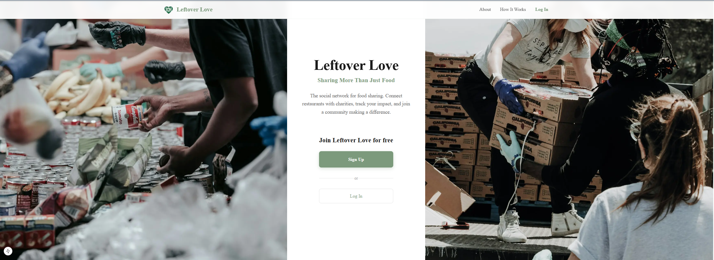
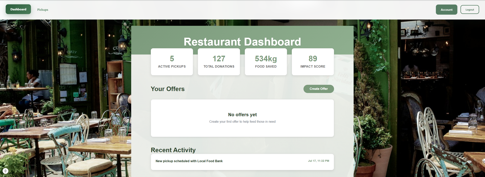
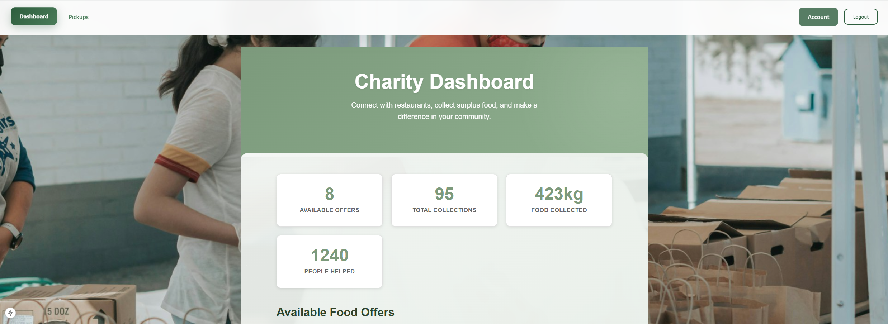

# Leftover Love

**What is leftover love?**

Leftover Love started as a hackathon project that was too impactful for us to just let it sit. It is a social impact platform that connects restaurants with surplus food to charities and local food banks. Our mission is to reduce food waste while helping communities in need, turning surplus into smiles and waste into warmth.


## Features

### For Restaurants
- **Food Listing Management**: Easily list surplus food items instead of discarding them
- **Impact Tracking**: Monitor environmental impact and community contribution
- **Pickup Coordination**: Schedule and manage food pickup with local charities
- **Analytics Dashboard**: Track donations, food saved, and people helped

### For Charities
- **Food Discovery**: Browse available food donations from local restaurants
- **Pickup Scheduling**: Coordinate pickup times that work for your organization
- **Impact Reporting**: Track received donations and community impact
- **Profile Management**: Maintain charity information and contact details

### Platform Features
- **Real-time Updates**: Live food availability and pickup status
- **Ratings on both ends**: Both parties can rate their experience with each other
- **Real impact metrics**: Shows the amount of love the organization has given through metrics
- **Secure Authentication**: JWT-based authentication for both user types
- **Responsive Design**: Works seamlessly on desktop and mobile devices
- **RESTful API**: Complete API documentation with Swagger/OpenAPI

## Tech Stack

### Backend
- **FastAPI**: Modern, fast web framework for building APIs
- **SQLAlchemy**: Python SQL toolkit and Object-Relational Mapping
- **Alembic**: Database migration tool
- **SQLite**: Lightweight database for development (PostgreSQL for production)
- **Pydantic**: Data validation using Python type annotations
- **JWT**: Secure authentication and authorization

### Frontend
- **Next.js 15**: React framework with server-side rendering
- **React 19**: Modern UI library with hooks and functional components
- **CSS Modules**: Scoped styling for component-based architecture
- **Responsive Design**: Mobile-first approach with modern CSS Grid/Flexbox

## Prerequisites

Before running this application, make sure you have:

- **Node.js** (v16 or higher) - [Download here](https://nodejs.org/)
- **Python** (v3.9 or higher) - [Download here](https://www.python.org/downloads/)
- **Git** - [Download here](https://git-scm.com/)

## Installation & Setup

### 1. Clone the Repository
```bash
git clone https://github.com/yourusername/leftover-love.git
cd leftover-love
```

### 2. Backend Setup
```bash
cd backend

# Create virtual environment
python -m venv venv

# Activate virtual environment
# Windows:
venv\Scripts\activate
# macOS/Linux:
source venv/bin/activate

# Install dependencies
pip install -r requirements.txt

# Set up environment variables
cp .env.example .env
# Edit .env with your configuration

# Run database migrations
alembic upgrade head

# Start the development server
python main.py
```

The API will be available at `http://localhost:8000`
- API Documentation: `http://localhost:8000/docs`
- Alternative docs: `http://localhost:8000/redoc`

### 3. Frontend Setup
```bash
cd frontend/nowastewebapp

# Install dependencies
npm install

# Set up environment variables
cp .env.example .env.local
# Edit .env.local with your configuration

# Start the development server
npm run dev
```

The frontend will be available at `http://localhost:3000`

## Configuration

### Backend Environment Variables (.env)
```env
# Database
DATABASE_URL=sqlite:///./sql_app.db

# Security
SECRET_KEY=your-secret-key-here
ALGORITHM=HS256
ACCESS_TOKEN_EXPIRE_MINUTES=30

# CORS
FRONTEND_URL=http://localhost:3000
```

### Frontend Environment Variables (.env.local)
```env
NEXT_PUBLIC_API_URL=http://localhost:8000
```

## API Documentation

The API follows RESTful conventions and includes comprehensive documentation:

### Authentication Endpoints
- `POST /api/auth/signup` - Register new user
- `POST /api/auth/login` - User login
- `GET /api/auth/me` - Get current user info

### Restaurant Endpoints
- `POST /api/restaurants/profile` - Create restaurant profile
- `GET /api/restaurants/profile` - Get restaurant profile
- `GET /api/restaurants/stats` - Get restaurant statistics

### Charity Endpoints
- `POST /api/charities/profile` - Create charity profile
- `GET /api/charities/profile` - Get charity profile

### Food Listing Endpoints
- `GET /api/listings/` - Get all available food items
- `POST /api/listings/` - Create new food listing
- `PUT /api/listings/{id}` - Update food listing
- `DELETE /api/listings/{id}` - Delete food listing
- `POST /api/listings/{id}/pickup` - Schedule pickup

## Testing

### Backend Testing
```bash
cd backend
pytest
```

### Frontend Testing
```bash
cd frontend/nowastewebapp
npm test
```

## Deployment

### Backend Deployment (Railway/Heroku)
1. Set up production database (PostgreSQL)
2. Configure environment variables
3. Deploy using platform-specific instructions

### Frontend Deployment (Vercel/Netlify)
1. Connect your Git repository
2. Configure build settings
3. Set environment variables
4. Deploy

## Contributing

We welcome contributions! Please follow these steps:

1. Fork the repository
2. Create a feature branch: `git checkout -b feature/amazing-feature`
3. Commit your changes: `git commit -m 'Add amazing feature'`
4. Push to the branch: `git push origin feature/amazing-feature`
5. Open a Pull Request


## Team

Made by Jayden Truong, Michael Bazzett, Rohin Aulukh, and Hugo Najafi (Goats)


---


